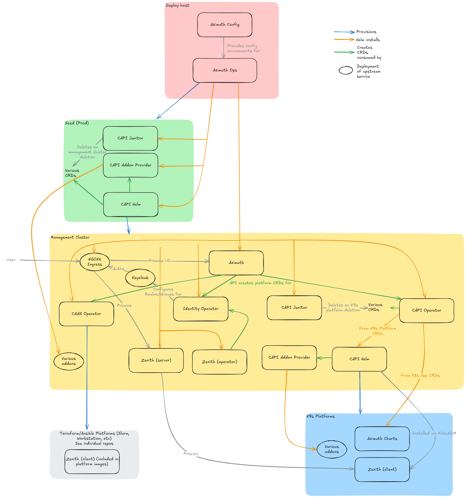

# Debugging Azimuth

This section provides tips on debugging some common issues with the components of
an Azimuth installation.

All of these debugging tips assume that you have activated the environment that you
want to debug using:

```sh
source ./bin/activate my-site
```

## Azimuth component map

The Azimuth ecosystem has many interconnected components. The image below provides a high-level
view of their interactions.


