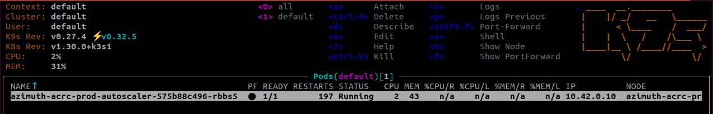
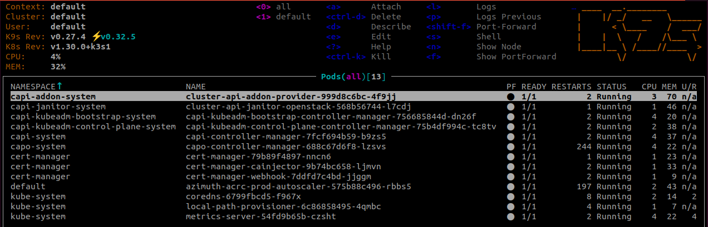
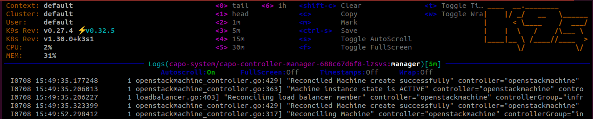

# Using K9s

K9s is installed onto the seed VM. You can use this for a more interactive view
of the Kubernetes clusters. From the seed, either run `k9s` with `KUBECONFIG`
unset to view the K3s cluster, or export the provided `KUBECONFIG` file to view
the HA cluster.

```console
$ ./bin/seed-ssh
ubuntu@azimuth-staging-seed:~$ export KUBECONFIG=./kubeconfig-azimuth-staging.yaml
ubuntu@azimuth-staging-seed:~$ k9s
```

By default, you are viewing the pods in the default namespace.



Here's some simple commands to get started:

* View all namespaces by pressing `0`.

  

* Select a pod with the arrow keys and view its logs with `l`.

  

* Switch between resources with `:<resource-type>`. For example:

  ```console
  :machines
  :clusters
  :pods
  ```


See the [k9s docs](https://k9scli.io/) for more details.
