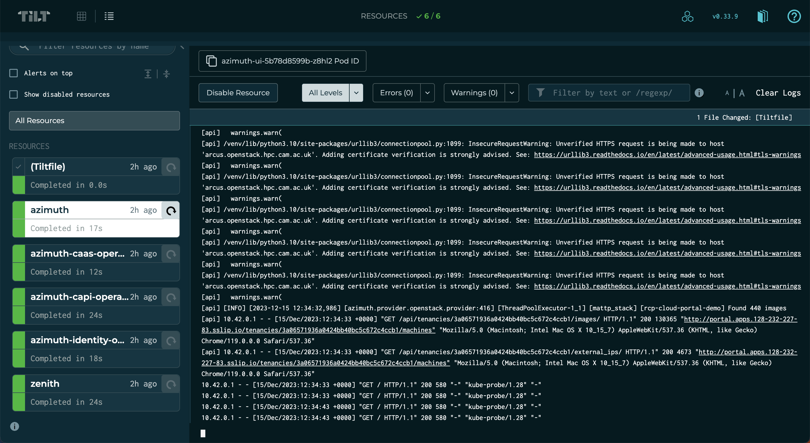

# Developing Azimuth

An Azimuth deployment consists of several interdependent components, some of which are
Azimuth-specific and some of which are third-party components. Plugging code under
development into such a system can be tricky, making development difficult and slow.

## Deploying a dev instance

In order to develop Azimuth, you first need a running Azimuth instance.

Each developer should have their own independent instance of Azimuth for development,
as during development they will make changes to the running Azimuth components that may
conflict with or break things for others.

### Creating a dev environment

Azimuth supports using a single [configuration environment](../environments.md) to deploy multiple
independent Azimuth instances. When
[activating an environment](../deployment/#activating-an-environment), a unique instance name
can be given as a second argument to the `activate` script, e.g.:

```bash
# Activating an environment with a unique instance name
source ./bin/activate my-environment jbloggs
```

In order for an environment to be used in this way, it must be specially prepared to be more
dynamic than an environment that you would use for staging or production. In particular, only
[single node deployments](../configuration/02-deployment-method.md#single-node) are usable in
this way, as HA deployments do not support dynamically allocating a floating IP for the ingress
controller.

It is recommended that you create an environment in your Azimuth configuration repository
for doing Azimuth development on your cloud. This environment should include any site-specific
customisations that are required, usually by building on a
[site mixin](../environments.md#using-mixin-environments). The
[demo environment](https://github.com/azimuth-cloud/azimuth-config/tree/devel/environments/demo)
is a good starting point for this, as it is designed to be flexible and dynamic.

!!! tip  "Producing unique values in your Azimuth configuration"

    The Ansible variable `azimuth_environment` contains the unique instance name, and
    can be used in other variables in your configuration where a unique value is required
    for each developer environment.

!!! warning  "Developers should use their own application credential"

    You should not include an application credential in your development environment.
    Instead, each developer can use their own application credential as described in the
    next section.

### Using the dev environment

The following instructions assume that your Azimuth configuration contains a developer environment
called `dev`. It is assumed that you have your Azimuth configuration checked out and that you have
an [application credential](https://docs.openstack.org/keystone/latest/user/application_credentials.html)
for the target cloud.

To stand up your developer-specific Azimuth instance, using the `dev` environment, use the
following:

```bash
# Set OpenStack configuration variables
export OS_CLOUD=openstack
export OS_CLIENT_CONFIG_FILE=/path/to/clouds.yaml

# Activate the dev config environment with a specific instance name
#
# This means that resources created for the instance will not collide
# with other deployments that use the dev environment
source ./bin/activate dev jbloggs-dev

# Install Azimuth as usual
ansible-galaxy install -f -r requirements.yml
ansible-playbook azimuth_cloud.azimuth_ops.provision
```

## Developing Azimuth components

Azimuth has a number of components, mostly written in Python:

  * [Azimuth API and UI](https://github.com/azimuth-cloud/azimuth) - user-facing API and UI
  * [Azimuth CaaS operator](https://github.com/azimuth-cloud/azimuth-caas-operator) - Kubernetes operator implementing CaaS functionality
  * [Azimuth CAPI operator](https://github.com/azimuth-cloud/azimuth-capi-operator) - Kubernetes operator implementing Kubernetes and Kubernetes App functionality
  * [Azimuth identity operator](https://github.com/azimuth-cloud/azimuth-identity-operator) - Kubernetes operator implementing platform identity
  * [Azimuth schedule operator](https://github.com/azimuth-cloud/azimuth-schedule-operator) - Kubernetes operator implementing platform scheduling
  * [Zenith](https://github.com/azimuth-cloud/zenith) - secure, tunnelling application proxy used to expose platform services
  * [Cluster API addon provider](https://github.com/azimuth-cloud/cluster-api-addon-provider) - addons for Cluster API clusters
  * [Cluster API janitor for OpenStack](https://github.com/azimuth-cloud/cluster-api-janitor-openstack) - resource cleanup for Cluster API clusters on OpenStack clouds

It is useful to develop these components in the context of a running Azimuth installation,
as they have dependencies on each other.

To enable this, Azimuth uses [Tilt](https://tilt.dev/) to provide a developer environment
where code under development is automatically built and injected into a live system that
you can interact with. Tilt provides a dashboard that can be used to drill down into
build failures and the logs of the components under development.



### Prerequisites

In order to use Tilt to develop Azimuth, the following tools must be available on your
development machine (in addition to those required to install Azimuth itself):

  * The [Tilt CLI](https://docs.tilt.dev/install.html)
  * A `docker` command, e.g. [Docker Desktop](https://docs.docker.com/desktop/)
  * The [kubectl command](https://kubernetes.io/docs/tasks/tools/#kubectl)
  * The [Helm CLI](https://helm.sh/docs/intro/install/)

For developing the Azimuth UI, the following are also required:

  * [node.js](https://nodejs.org)
  * The [Yarn Classic](https://classic.yarnpkg.com/lang/en/docs/install/) package manager

### Configuring a container registry

Azimuth's Tilt configuration looks for a file called `tilt-settings.yaml` that defines settings
for the development environment. This file is specific to you and should not be added to version
control (it is specified in `.gitignore`).

In order to get the code under development into your running Azimuth instance, Tilt must have
access to a container registry that is accessible to both your development machine and the
Azimuth instance. In response to code changes, Tilt will automatically build and push images
to this registry and then configure the Azimuth instance to use them.

To configure the prefix for images built by Tilt, use the following setting:

```yaml  title="tilt-settings.yaml"
# Images will be pushed to:
#   ghcr.io/jbloggs/azimuth-api
#   ghcr.io/jbloggs/azimuth-ui
#   ghcr.io/jbloggs/azimuth-caas-operator
#   ...
image_prefix: ghcr.io/jbloggs
```

!!! tip
    
    A good candidate for this is to use [GitHub Packages](https://github.com/features/packages)
    with your user account, as in the example above. This means that development builds do not
    require access to or clutter up the production repositories.

    When using GitHub Packages, the repositories that are created by Tilt when it builds images
    for the first time will be private. You must log into GitHub and make them public before
    your Azimuth instance can use them. Until you do this, you will see image pull errors in
    the Tilt interface.

### Using the Tilt environment

Tilt will look for checkouts of Azimuth components as siblings of your Azimuth configuration
and include them in your development environment. For example, the following directory structure
will result in a development environment where changes to the Azimuth API, UI and CaaS operators
are built and pushed into your development Azimuth instance for testing:

```
.
├── azimuth
│   ├── api
│   ├── chart
│   ├── ui
│   └── ...
├── azimuth-caas-operator
│   ├── Dockerfile
│   ├── azimuth_caas_operator
│   ├── charts
│   └── ...
└── myorg-azimuth-config
    ├── Tiltfile
    ├── bin
    ├── environments
    ├── tilt-settings.yaml
    └── ...
```

If you wish to prevent a particular component being included in your development environment,
even if the checkout exists as a sibling, you can configure this using the `enabled` flag for
the component in `tilt-settings.yaml`. For example, the following would prevent the CaaS
operator from being included in the development environment, even with the directory structure
above:

```yaml  title="tilt-settings.yaml"
components:
  azimuth-caas-operator:
    enabled: false
```

Once you have checked out all of the components that you want to develop, you can start the
development environment using:

```bash
./bin/tilt-up
```

This will configure Tilt to connect to your Azimuth instance and begin watching your local
checkouts for changes. When a change is detected, Tilt will build and push an image for the
component before reconfiguring the Helm release for the component to point to the new image.
Once this process is complete, you can interact with your changes using the Azimuth UI for
your instance.

!!! tip

    Press the space bar to launch the [Tilt user interface](https://docs.tilt.dev/tutorial/3-tilt-ui.html).

When the `tilt-up` command is terminated, all of the Helm releases for the components that
were under development are rolled back to the version that was running before the command
was started.

### Local UI development

Because of how the user interface is optimised for production, the container image build for
the Azimuth UI is very slow even for a minor change. Because of this, the usual Tilt flow of
build/push/deploy is not suitable for UI development.

To improve the feedback cycle for UI development, the Azimuth Tilt environment also builds
and runs the Azimuth UI locally using the
[webpack DevServer](https://webpack.js.org/configuration/dev-server/). The UI communicates
with the Azimuth API on your Azimuth dev instance using a forwarded port (this is necessary
in order for the cookie-based authentication to work properly).

The local version of the UI is available at `http://localhost:3000`.

!!! note

    The UI container image is still built, pushed and deployed in the background.
    However changes made to the JS files will be visible in the local version much faster.
