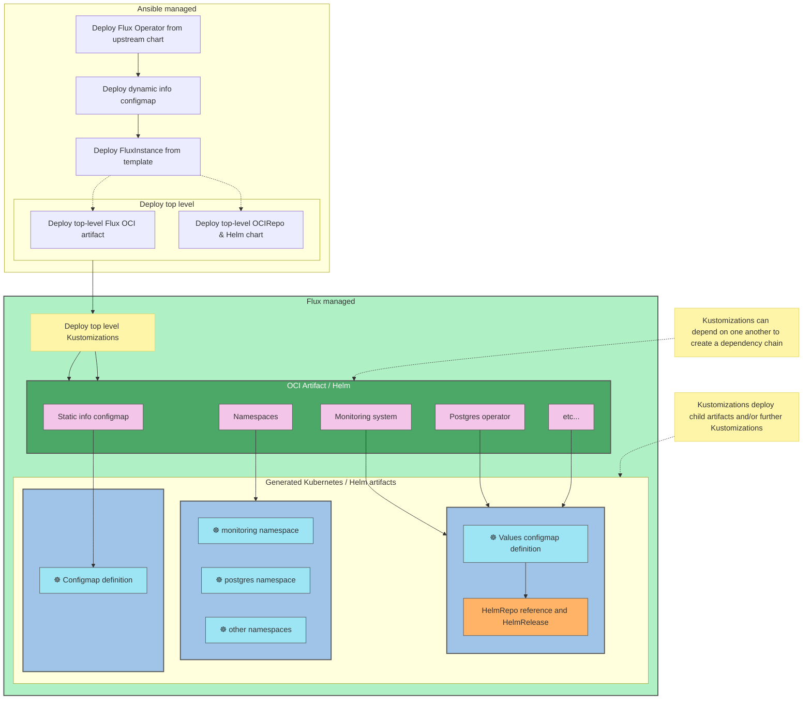

```mermaid
flowchart TB
    subgraph ANSIBLE["Ansible managed"]
        direction TB

        FX_OP["Deploy Flux Operator from upstream chart"]
        DY_CM["Deploy dynamic info configmap"]
        FX_IN["Deploy FluxInstance from template"]

        subgraph FX_TOP["Deploy top level"]
            direction LR

            FX_IN_ART["Deploy top-level Flux OCI artifact"]
            FX_HELM["Deploy top-level OCIRepo & Helm chart"]
        end

        FX_OP --> DY_CM --> FX_IN
        FX_IN -.-> FX_IN_ART
        FX_IN -.-> FX_HELM
    end

    %% Flux-managed environment
    subgraph FLUX["Flux managed"]
        direction TB

        subgraph HELM["OCI Artifact / Helm"]
            direction LR

            STATIC["Static info configmap"]
            NS["Namespaces"]
            MON["Monitoring system"]
            PG["Postgres operator"]
            ETC["etc..."]
        end

        subgraph ARTIFACTS["Generated Kubernetes / Helm artifacts"]
            direction LR

            subgraph CONFIG[" "]
                CONFIGMAP["☸️ Configmap definition"]
            end

            subgraph NAMESPACES[" "]
                MON_NS["☸️ monitoring namespace"]
                PG_NS["☸️ postgres namespace"]
                OTHER_NS["☸️ other namespaces"]
            end

            subgraph VALUES[" "]
                direction TB
                VALUES_CM["☸️ Values configmap definition"]
                HELM_REF["HelmRepo reference and HelmRelease"]
            end
        end

        %% Helm customizations create artifacts
        FX_TOP --> DEPLOY
        DEPLOY --> HELM
        STATIC --> CONFIGMAP
        NS --> NAMESPACES

        %% Dependency chain / child customizations
        MON --> VALUES
        PG --> VALUES
        ETC --> VALUES

        VALUES_CM --> HELM_REF
    end

    %% External deployment trigger
    DEPLOY["Deploy top level Kustomizations"] --> HELM

    %% Notes
    NOTE1["Kustomizations can depend on one another to create a dependency chain"]
    NOTE2["Kustomizations deploy child artifacts and/or further Kustomizations"]

    NOTE1 -.-> HELM
    NOTE2 -.-> ARTIFACTS

    classDef flux fill:#b0f0c5,stroke:#555,stroke-width:2px;
    classDef helm fill:#4ca866,stroke:#555,stroke-width:2px,color:#fff;
    classDef kustom fill:#f3c5e8,stroke:#555,stroke-width:1px;
    classDef artifact fill:#9fc4e8,stroke:#555,stroke-width:2px;
    classDef resource fill:#9de4f5,stroke:#555,stroke-width:1px;
    classDef helmref fill:#ffb366,stroke:#555,stroke-width:1px;
    classDef note fill:#fff5a8,stroke:#e5d76a,stroke-width:1px;

    class FLUX flux;
    class HELM helm;
    class STATIC,NS,MON,PG,ETC kustom;
    class CONFIG,NAMESPACES,VALUES artifact;
    class CONFIGMAP,MON_NS,PG_NS,OTHER_NS,VALUES_CM resource;
    class HELM_REF helmref;
    class NOTE1,NOTE2,DEPLOY note;
```